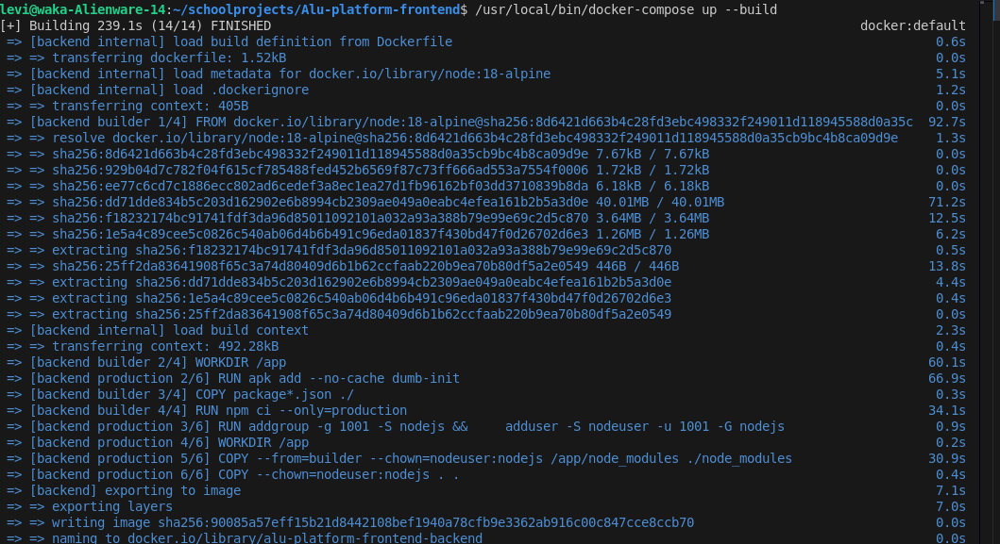

# ALU Graduates Empowerment Platform
> Connecting ALU's brightest innovations with the investors, sponsors, and buyers who can bring them to life.

---

## African Context

Africa produces thousands of highly skilled graduates every year, yet many innovative projects developed during their studies never reach the people who could fund or scale them. At African Leadership University (ALU), graduates consistently build high-potential solutions — but after graduation, institutional visibility fades and there is no centralized space to bridge that gap.

This platform solves that problem by giving ALU graduates a dedicated digital space to showcase their projects to investors, sponsors, and buyers across Africa and beyond. It directly supports entrepreneurship, job creation, and socio-economic development by turning hidden talent into visible opportunity.

---

## Team Members

| Name | Role | Student ID |
|------|------|------------|
| Levis Ishimwe | Full-Stack Developer & DevOps Lead | i.levis@alustudent.com |
| Obasi-Otani Owai Ibe | Backend Developer | o.ibe@alustudent.com |
| Elise Julio Hakizimana | Frontend Developer | j.hakiziman1@alustudent.com |
| Karangwa Kethia | Frontend Developer | k.karangwa@alustudent.com |

---

## Project Overview

The **ALU Graduates Empowerment Platform** is a web-based application that allows ALU graduates to create profiles, upload their projects, and connect directly with potential investors, sponsors, and buyers. Each project listing includes a description, category, media (images/videos), GitHub repository link, LinkedIn profile, and contact details.

Stakeholders — investors, sponsors, and buyers — can browse, search, and filter projects by category, impact area, or location. When they find a project they are interested in, they can reach out directly to the graduate through the platform's built-in contact system.

The platform is built with a modern, mobile-first design using React.js and Tailwind CSS on the frontend, Node.js/Express on the backend, and MongoDB as the database — making it fast, scalable, and accessible to users across Africa on any device or connection speed.

---

## Target Users

- **ALU Graduates** — individuals or teams who want to showcase their projects and attract support
- **Investors & Sponsors** — organizations or individuals actively looking for African innovation to fund or partner with
- **Buyers** — entities interested in purchasing or licensing graduate-built solutions
- **Platform Admins** — ALU staff who moderate content and manage platform activity

---

## Core Features

- **Graduate Profiles** — Graduates create accounts and build detailed profiles with their bio, ALU cohort, and contact information
- **Project Listings** — Upload projects with title, description, category, images, video, GitHub link, and LinkedIn profile
- **Search & Filter** — Investors can browse projects filtered by category, impact area, or location
- **Direct Contact** — Stakeholders can reach out to graduates directly via email or LinkedIn from the platform
- **Engagement Dashboard** — Graduates can track project views, messages received, and overall engagement metrics
- **Admin Moderation Panel** — Admins can approve, reject, or flag content and monitor platform activity

---

## Technology Stack

- **Frontend:** React.js, Tailwind CSS
- **Backend:** Node.js, Express.js
- **Database:** MongoDB (MongoDB Atlas)
- **Authentication:** JWT (JSON Web Tokens)
- **Media Storage:** Cloudinary
- **Email Notifications:** Nodemailer / SendGrid
- **Containerization:** Docker, Docker Compose
- **CI/CD:** GitHub Actions
- **Version Control:** Git & GitHub
- **Deployment:** Render (Backend), Vercel (Frontend)

---

## Getting Started

### Prerequisites

- Node.js v18+
- npm v9+
- MongoDB Atlas account (or local MongoDB instance)
- Git
- Docker & Docker Compose (optional, for containerized setup)

---

### Option 1: Run with Docker Compose (Recommended)

1. **Clone the repository**
   ```bash
   git clone https://github.com/levishimwe/Alu-graduates-platiform.git
   cd Alu-graduates-platiform
   ```

2. **Create environment file** at project root:
   ```env
   JWT_SECRET=your_jwt_secret_key
   CLIENT_URL=http://localhost:3000
   CLOUDINARY_CLOUD_NAME=your_cloudinary_name
   CLOUDINARY_API_KEY=your_cloudinary_api_key
   CLOUDINARY_API_SECRET=your_cloudinary_api_secret
   GMAIL_USER=your_gmail
   GMAIL_APP_PASSWORD=your_app_password
   ADMIN_SECRET_KEY=your_admin_key
   ```

3. **Start all services**
   ```bash
   docker-compose up --build
   
   
   
   ```

4. **Open in browser**
   ```
   Frontend: http://localhost:3000
   Backend:  http://localhost:5000/api/health
   ```

5. **Stop services**
   ```bash
   docker-compose down
   ```

---

### Option 2: Run Manually

1. **Clone the repository**
   ```bash
   git clone https://github.com/levishimwe/Alu-graduates-platiform.git
   cd Alu-graduates-platiform
   ```

2. **Install backend dependencies**
   ```bash
   cd backend && npm install
   ```

3. **Install frontend dependencies**
   ```bash
   cd .. && npm install
   ```

4. **Create `backend/.env`**
   ```env
   PORT=5000
   MONGO_URI=your_mongodb_atlas_connection_string
   JWT_SECRET=your_jwt_secret_key
   CLOUDINARY_CLOUD_NAME=your_cloudinary_name
   CLOUDINARY_API_KEY=your_cloudinary_api_key
   CLOUDINARY_API_SECRET=your_cloudinary_api_secret
   ADMIN_SECRET_KEY=your_admin_key
   ```

5. **Run backend**
   ```bash
   cd backend && npm run dev
   ```

6. **Run frontend**
   ```bash
   cd .. && npm start
   ```

7. Open `http://localhost:3000`

---

## Project Structure

```
Alu-graduates-platiform/
├── backend/
│   ├── config/
│   ├── controllers/
│   ├── middleware/
│   ├── models/
│   ├── routes/
│   ├── services/
│   ├── socket/
│   ├── tests/
│   ├── utils/
│   ├── app.js
│   ├── server.js
│   ├── Dockerfile
│   └── package.json
├── src/
│   ├── components/
│   ├── context/
│   ├── hooks/
│   ├── services/
│   ├── styles/
│   ├── utils/
│   ├── App.js
│   └── index.js
├── .github/
│   └── workflows/
│       └── ci.yml
├── .dockerignore
├── .gitignore
├── docker-compose.yml
├── package.json
├── tailwind.config.js
└── README.md
```

---

## CI/CD Pipeline

GitHub Actions runs automatically on every push and PR targeting `main`:

1. Lint with ESLint
2. Run tests with Jest
3. Build Docker image

Status checks are required before merging to `main`.

---

## Links

- [Project Board](https://github.com/levishimwe/Alu-graduates-platiform/projects)

---

## License

[MIT License](./LICENSE)
